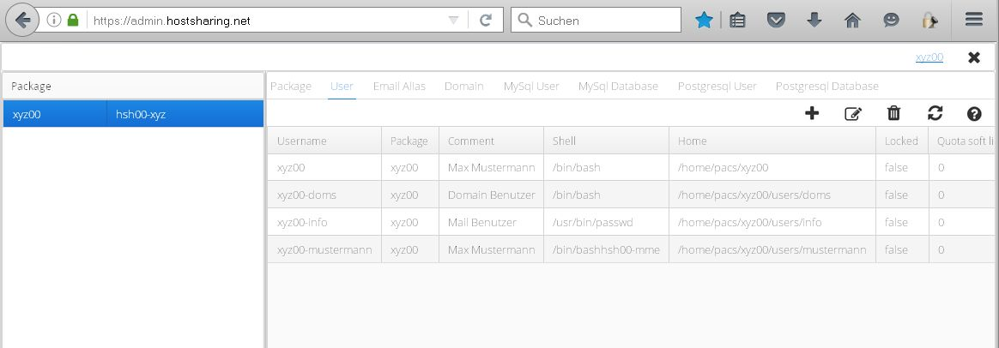
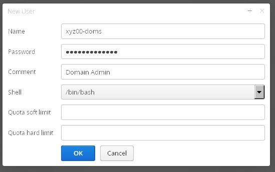

================
Benutzer anlegen
================

Aufruf des Webfrontends über den Link https://admin.hostsharing.net.

Es wird die Benutzerkennung des :doc:`Paketadmins<../administration/benutzer/paket-admin>` beim Benutzernamen und im Passwortfeld das entsprechende Passwort eingetragen.

.. image:: hsadmin-login-pa.jpg

Nach erfolgreichem Login wird die Startseite wie folgt angezeigt:

.. image:: hsadmin-start-pa.jpg

Um weitere Benutzer eines Web-Pakets an zu legen muss im Linken Fenster auf *Package* geklickt werden. Es zeigt sich dann die Paket Übersicht:

Dort wird nun im Rechten Fenster auf den Tab *User* gewechselt.

Da die :doc:`Domain<../administration/domain/index>` aus Sicherheitsgründen nur einem :doc:`Benutzer<../administration/benutzer/index>` innerhalb einer Benutzerkennung zugeordnet werden soll, wird ein neuer :doc:`Domain-Admin<../administration/benutzer/domain-admin>`-Benutzer in dem Web-Paket xyz00 angelegt.
        
Auf das Icon *+* klicken und folgende Eingabemaske wie folgt ausfüllen:

Bestätigung mit dem Button *speichern*

