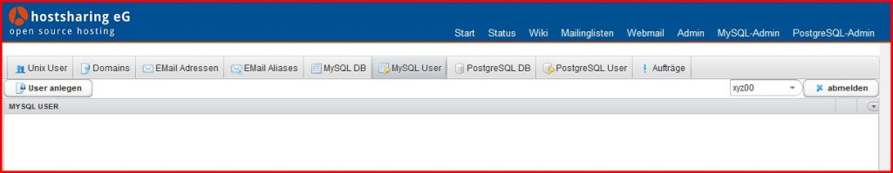
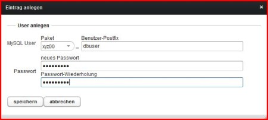
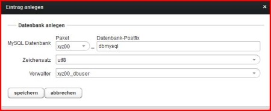

====================
Datenbank einrichten
====================

.. |date| date:: %d.%m.%Y
.. |time| date:: %H:%M

:Authors: - Michael Hierweck
          - Uwe Müller
          - Christian Günter
:Date: |date|, |time|

Beim Anlegen einer Datenbank ist die Reihenfolge entscheidend.

Es muss erst der DB-User, also der Verwalter der jeweiligen DB erstellt werden, anschließend wird die DB selber angelegt.

Wir melden uns mit der Paket Benutzerkennung xyz00 unter https://admin.hostsahring.net an.

Wechsel auf dem Tab *MySQL User* und sehen den folgenden Bildschirm:

Nach Button *User anlegen* erscheint diese Maske:

Die Felder werden wie folgt belegt:

MySQL User: xyz00

Benutzer-Posfix: dbuser (Zulässige Zeichen: 0 bis 9 und a bis z Buchstaben)

Passwort: PASSWORT

Mit dem Tab *MySQL DB* und dort der Button *Datenbank anlegen* wird nun diese Maske sichtbar:

Die Felder hier:

MySQL Datenbank 

Paket: xyz00

Datenbank-Postfix: dbmysql (Zulässige Zeichen: 0 bis 9 und a bis z Buchstaben)

Zeichensatz: utf8

Verwalter: xyz00_dbuser

