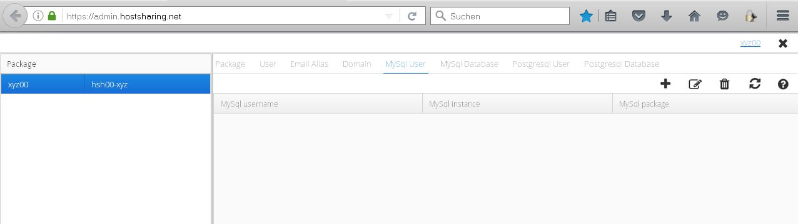

====================
Datenbank einrichten
====================
Beim Anlegen einer Datenbank ist die Reihenfolge entscheidend:

* Zunächst den Datenbanknutzer anlegen, den Verwalter der jeweiligen Datenbank
* Anlegen der Datenbank angelegt.

Anmeldung mit dem Paket-Admin xyz00 unter https://admin.hostsharing.net.

.. image:: hsadmin-login-pa.jpg

Nach erfolgreichem Login wird die Startseite des PaketAdmin angezeigt.

Wir wählen im linken Fenster unter *Package* ein Paket aus.
Nun wird im rechten Fenster auf den Tab *MySQL User* geklickt:

Mit dem Icon *+* erscheint folgende Eingabemaske:

Die Felder werden wie folgt belegt:

Name: xyz00_dbuser

Passwort: PASSWORT

Mit dem Button *OK* wird der Eintrag gespeichert.

Mit dem Tab *MySQL Database* und dort dem Icon *+* wird diese Eingabemaske sichtbar:

Die Felder hier:

Name: xyz00_dbmysql

Owner: xyz00_dbuser

Encoding: UTF8

Mit dem Button *OK* wird auch der Eintrag gespeichert.

