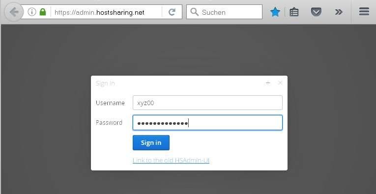
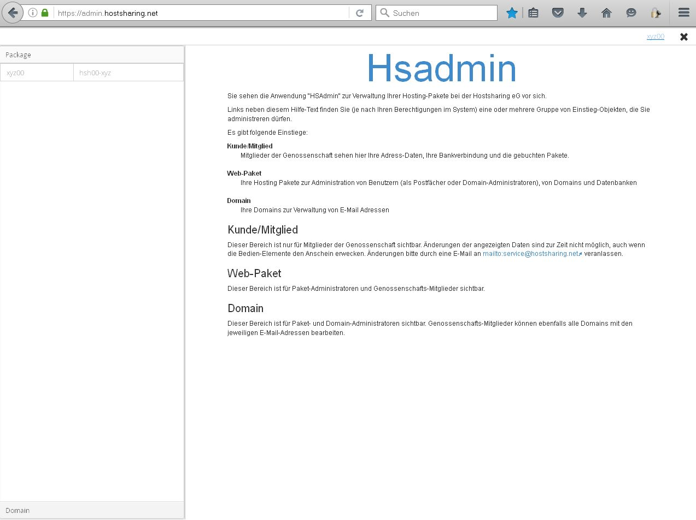
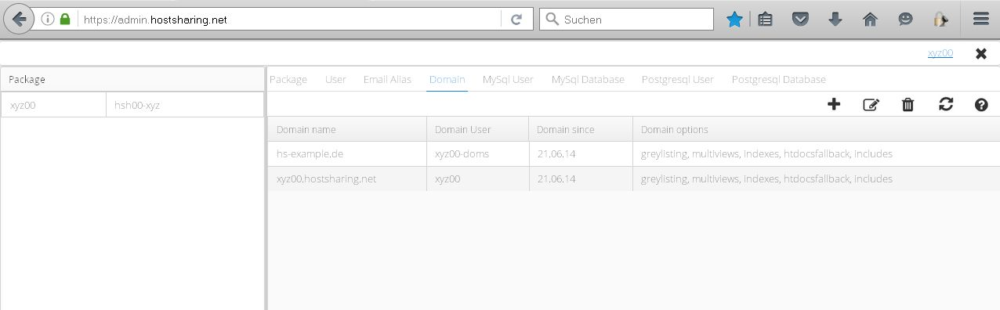
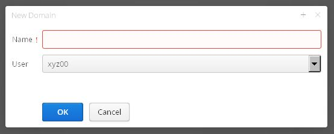

================
Domain bestellen
================
Eine Domain wird in zwei Schritten angelegt:

#. Die Domain im Web-Paket xyz00 aufschalten
#. Die Domain im Domainbestellsystem bestellen

Die Domain auf dem Hostsharing-Server anlegen
---------------------------------------------

Aufruf des Webfrontends über den Link https://admin.hostsharing.net.

Es wird die Benutzerkennung des :doc:`Paketadmins<../administration/benutzer/paket-admin>` (xyz00) beim Benutzernamen und im Passwortfeld das entsprechende Passwort eingetragen.

Für das Anlegen einer Domain zunächst im linken Fenster den Reiter Package auswählen:

Nun im linken Fensterteil das gewünschte *Paket* an klicken und dann im rechten Fenster den Tab *Domains* aktivieren.
Es erscheint folgender Bildschirm:

 
Nun mit dem Icon *+* eine neue Domain aufschalten.

Die Eingabemaske wird mit folgenden Daten gefüllt:

Im Feld Domain den neuen Domainnamen und als Adminstrator den :doc:`Domain-Admin<../administration/benutzer/domain-admin>` xyz00-domains eintragen.

Mit dem Button *OK* bestätigen.

Damit ist die Domain in dem Web-Paket xyz00 technisch angelegt.

Die Domain im Domainbestellsystem bestellen
-------------------------------------------

Anschließend kann die Domain hs-example.de unter dem Link https://www.domain-bestellsystem.de bestellt werden.
Die Login-Daten dafür wurden Ihnen auf einem separatem Weg mitgeteilt.

