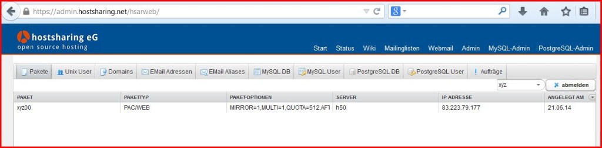
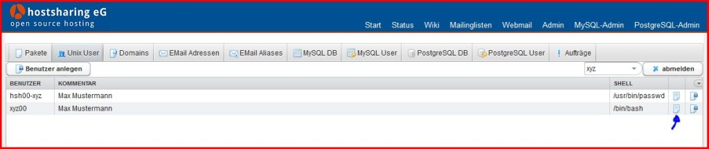
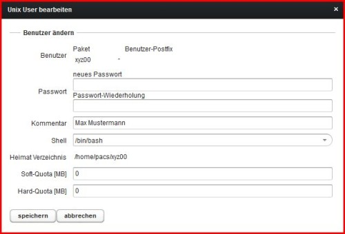

================
Domain bestellen
================

.. |date| date:: %d.%m.%Y
.. |time| date:: %H:%M

:Authors: - Michael Hierweck
          - Uwe Müller
          - Veit Schiele
          - Christian Günter
:Date: |date|, |time|

Eine Domain wird in zwei Schritten bei HS aktiviert.

1. Die Domain auf dem HS Server anlegen

2. Die Domain im Domainbestellsystem bestellen

1. Neue Domain example.de aufschalten

Wir rufen die Seite https://admin.hostsharing.net in einem Browser auf und werden auf die https://login.hostsharing.net Seite mit einem CAS Login weiter geleitet.

Es wird die Mitgliederkennung beim Benutzernamen und unter Passwort das entsprechende Passwort eingetragen.

.. image:: admin.hostsharing.net.jpg

Wir sehen alle Pakete des Mitglieds.

Da Domain aus Sicherheitsgünden nur einem Benutzer innerhalb einer Benutzerkennung zu geordnet werden sollen, legen wir als nächstes einen neuen Benutzer in userem Paket xyz00 an.

Dafür vergeben wir nun ein Passwort für die Benutzerkennung des Paketes xyz00.

Wir wechseln dazu in den Tab 'Unix User'.

und klicken in der Zeile
xyz00 rechts aus auf bearbeiten (blauer Pfeil im Bild)

Im folgendem Bild vergeben wir in den Zeilen Passwort ein entsprechendes Wort.

Wir bestätigen mit dem Speichern Button.

Nun melden wir uns as dem Admin Breich mit unserer Mitgleiderkennung ab.

Dazu einmal abmelden rechts aussen betätigen.

Auf der folgenden Seite wählen wir nun oben Admin und auf der Login Seite benutzen wir nun die Benutzerkennung xyz00 und das gerade vergeben Passwort.

