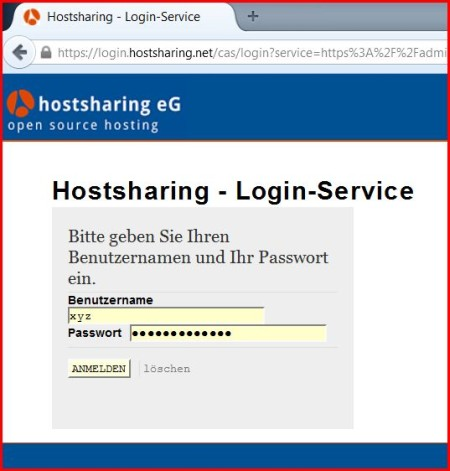
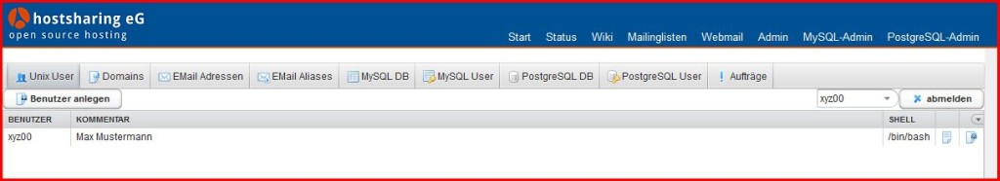
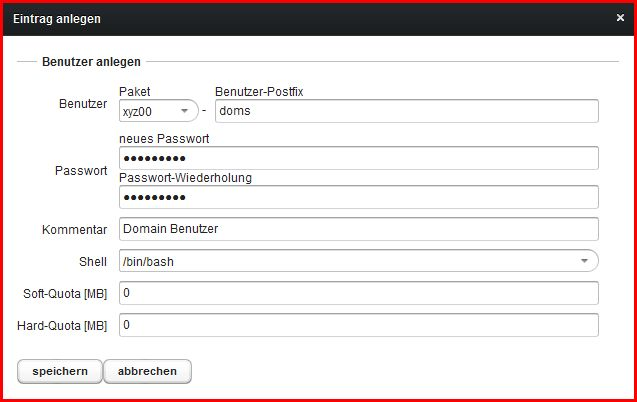
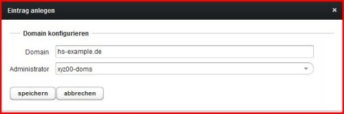

================
Domain bestellen
================

.. |date| date:: %d.%m.%Y
.. |time| date:: %H:%M

:Authors: - Michael Hierweck
          - Uwe Müller
          - Veit Schiele
          - Christian Günter
:Date: |date|, |time|

Eine Domain wird in zwei Schritten bei HS bestellt.

1. Die Domain auf dem HS Server anlegen

2. Die Domain im Domainbestellsystem bestellen

Die Domain auf dem HS Server anlegen
------------------------------------

Wir rufen die Seite https://admin.hostsharing.net in einem Browser auf und werden auf die Login Seite https://login.hostsharing.net weitergeleitet.

Es wird die Benutzerkennung des :doc:`Paketadmins<../administration/benutzer/paket-admin>` beim Benutzernamen und unter Passwort das entsprechende Passwort eingetragen.

Wir befinden uns jetzt hier:

Da die :doc:`Domain<../administration/domain/index>` aus Sicherheitsgünden nur einem :doc:`Benutzer<../administration/benutzer/index>` innerhalb einer Benutzerkennung zugeordnet werden soll, legen wir als nächstes einen neuen Benutzer in unserem Paket xyz00 an.
        
Weiter geht es mit dem Button *Benutzer anlegen* und wir füllen die folgende Maske wie folgt aus:

Damit kommen wir nun zur eigentlichen Aufgabe, eine :doc:`Domain<../administration/domain/index>` anzulegen.

Hierzu aktivieren wir den Tab *Domains* und wählen dort *Domain konfigurieren*.

Die Maske füllen wir mit folgenden Daten:

Bei Domain den neuen Domainnamen und als Adminstrator den :doc:`Domain-Admin<../administration/domain/verzeichnisebenen-domain-admin>` xyz00-doms eintragen.

Damit ist die Domain auf dem HS Server technisch angelegt.

Die Domain im Domainbestellsystem bestellen
-------------------------------------------

Anschliessend kann die Domain hs-example.de https://www.domainbestellsystem.de bestellt werden.
Die Login-Daten dafür wurden Ihnen auf einem separatem Weg mitgeteilt.

