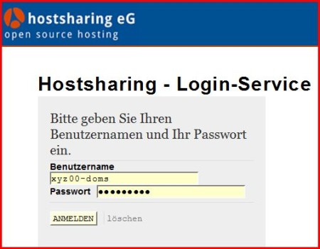
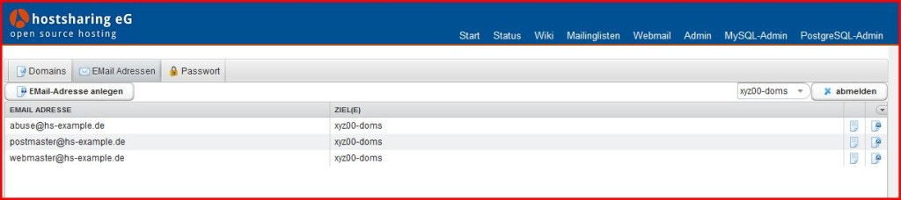
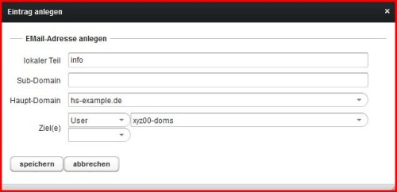
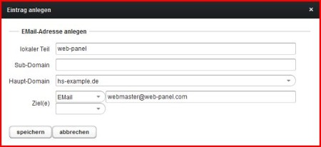
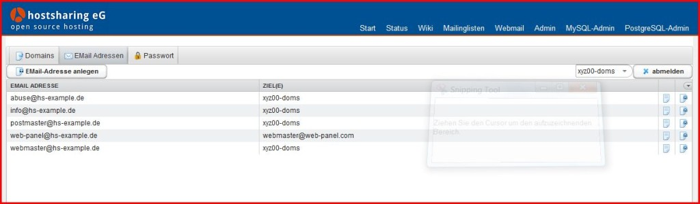

=================
E-Mail einrichten
=================

.. |date| date:: %d.%m.%Y
.. |time| date:: %H:%M

:Authors: - Michael Hierweck
          - Uwe Müller
          - Christian Günter
:Date: |date|, |time|

Es werden zwei E-Mail-Adressen angelegt:

* Die erste E-Mail-Adresse wird an einem Postfach im Webpaket zugeordnet
* Die zweite E-Mail-Adresse wird an einer externen E-Mail-Adresse zugeordnet.

E-Mail-Adresse an Postfach im Webpaket
--------------------------------------

Anmeldung unter https://admin.hostsharing.net als Domain-Admin (xyz00-doms) an:

Anschließend wird der Tab *EMail Adressen* aktiviert: 

Ist eine Domain angelegt, werden die drei E-Mail-Adressen (abuse@ postmaster@ und webmaster@) automatisch eingerichtet.

Der Button *EMail-Adresse anlegen* öffnet folgende Eingabemaske:

Die Felder im einzelnen:

lokaler Teil: info (der Name vor dem @ Zeichen)

Sub-Domain:   bleibt *hier* leer, es wird eine E-Mail-Adresse für die Hauptdomain angelegt.

Haupt-Domain: hs-example.de

Ziel:         User  xyz00-doms  (E-Mails sollen an ein Postfach gehen)

Bestätigen mit dem Button *speichen* 

E-Mail-Adresse mit Weiterleitung an externe Mail-Adresse
--------------------------------------------------------

Um eine weitere E-Mail-Adresse anzulegen die E-Mails an eine *externe* E-Mail-Adresse leitet, wird in der Eingabemaske bei:
Ziele: *E-Mail* ausgewählt und dahinter dann die externe Mail-Adresse, hier webmaster@web-panel.com, eingetragen.

Liste der angelegten E-Mail-Adressen:

