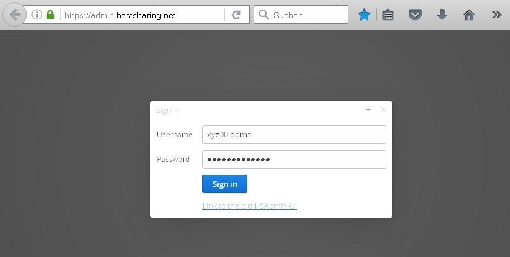
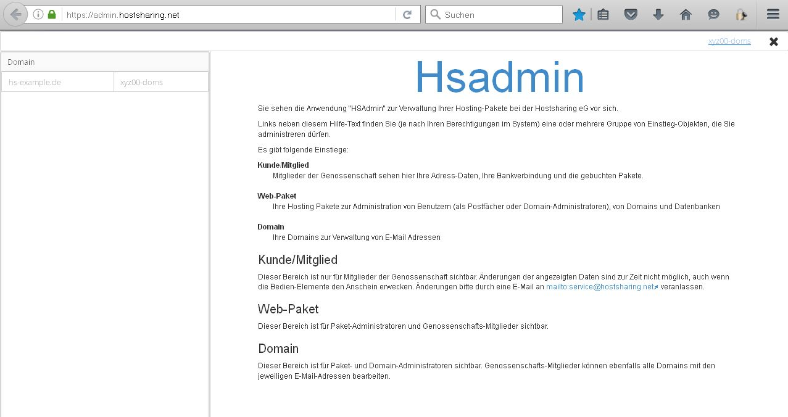
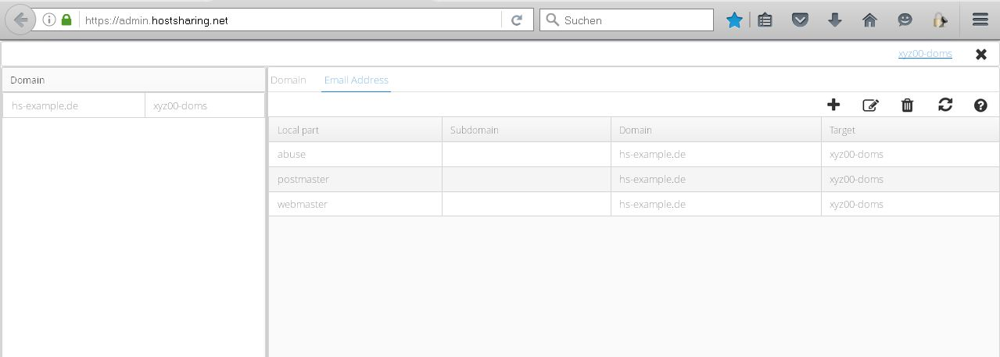
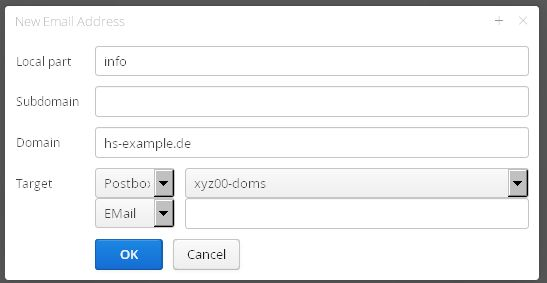
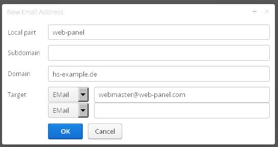
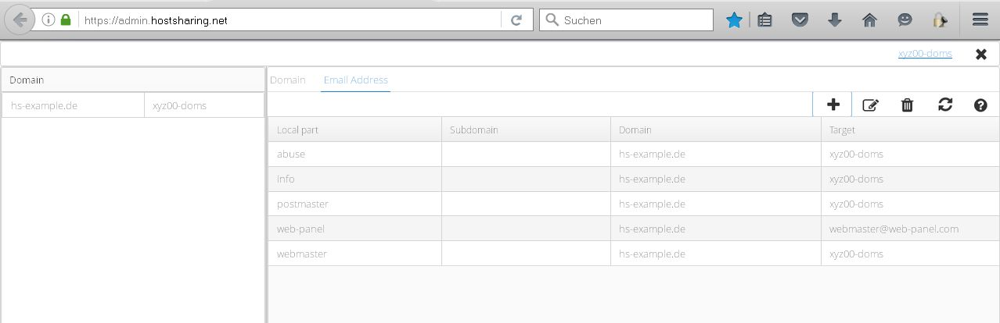

=================
E-Mail einrichten
=================
In diesem Beispiel werden zwei E-Mail-Adressen angelegt:

* Die erste E-Mail-Adresse wird einem Postfach im Webpaket zugeordnet
* Die zweite E-Mail-Adresse wird einer externen E-Mail-Adresse zugeordnet.

E-Mail-Adresse an Postfach im Webpaket
--------------------------------------

Anmeldung unter https://admin.hostsharing.net als Domain-Admin (xyz00-domains) an:

Nach erfolgreichem Login wird die Startseite des DomainAdmin angezeigt.

Anschließend wird im linken Fenster die Domain ausgewählt und im rechten Fenster der Tab *EMail Adress* aktiviert: 

Ist eine Domain neu angelegt, werden die drei E-Mail-Adressen (abuse@ postmaster@ und webmaster@) automatisch eingerichtet.

Mit dem Icon *+* öffnet sich folgende Eingabemaske:

Die Felder im einzelnen:

Locale Part: info (der Name vor dem @ Zeichen)

Subdomain:   bleibt *hier* leer, es wird eine E-Mail-Adresse für die Hauptdomain angelegt.

Domain: hs-example.de

Target:         Postbox  xyz00-domains  (E-Mails sollen an ein Postfach gehen)

Bestätigen mit dem Button *OK*

E-Mail-Adresse mit Weiterleitung an externe Mail-Adresse
--------------------------------------------------------

Um eine weitere E-Mail-Adresse anzulegen die E-Mails an eine *externe* E-Mail-Adresse leitet, wird in der Eingabemaske bei:
Target: *E-Mail* ausgewählt und dahinter dann die externe Mail-Adresse, hier webmaster@web-panel.com, eingetragen.

Liste der angelegten E-Mail-Adressen:

