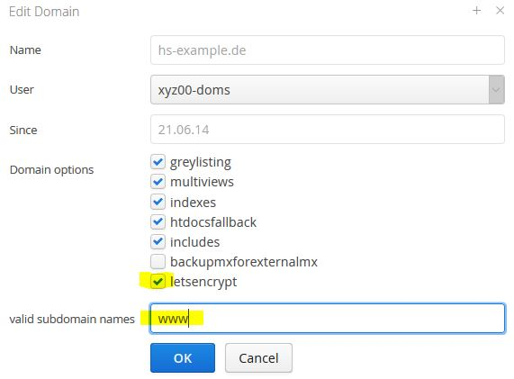

================
Let´s Encrypt einrichten
================
Wie einer Domain ein Let´s Encrypt Zertifikat zuordnen:

#. Die Domain ist schon einem Web-Paket Benutzer zugeordnent
#. Das Zertifikat erzeugen

Die Domain auf dem Hostsharing-Server anlegen
---------------------------------------------

Aufruf des Webfrontends über den Link https://admin.hostsharing.net.

Es wird die Benutzerkennung des :doc:`Paketadmins<../administration/benutzer/paket-admin>` (xyz00) beim Benutzernamen und im Passwortfeld das entsprechende Passwort eingetragen.

.. image:: hsadmin-login-pa.jpg

Für das aktivieren von Let´s Encrypt zunächst im linken Fenster den Reiter Package auswählen:

.. image:: hsadmin-start-pa.jpg

Nun im linken Fensterteil das gewünschte *Paket* an klicken und dann im rechten Fenster den Tab *Domains* aktivieren.
Es erscheint folgender Bildschirm:

.. image:: hsadmin-domain.jpg
 
Nun die gewünsche Domain auswählen und das *edit* Symbol an klicken
Die Eingabemaske wird mit folgenden Daten gefüllt:

Mit dem Button *OK* bestätigen.

Damit ist für die Domain ein Zertifikat angefordert.

Bis zur Zertifizierung vergehen normal nur 2-3 Minuten, es kann jedoch auch bis zu 24 Std dauern.

