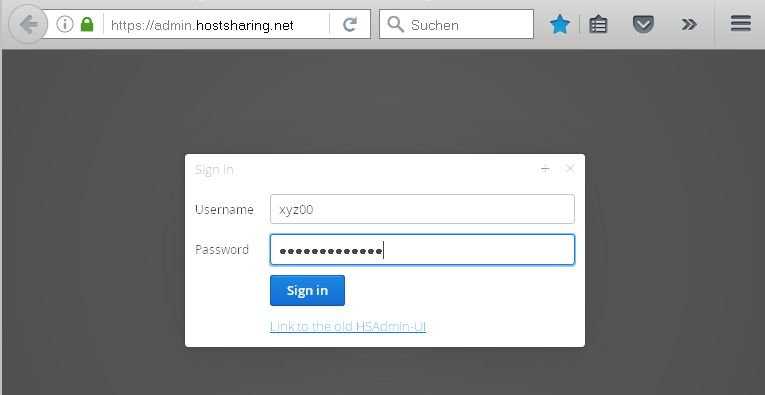
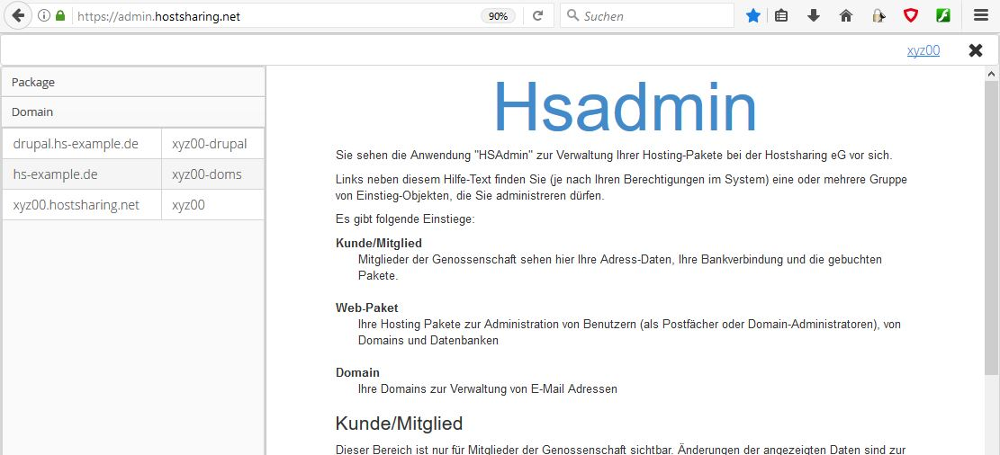
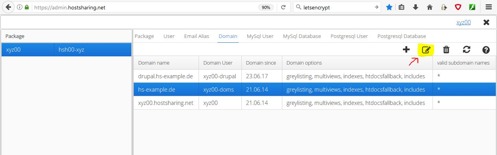

================
Let´s Encrypt einrichten
================
Wie einer Domain ein Let´s Encrypt Zertifikat zuordnen:

#. Die Domain ist schon einem Web-Paket Benutzer zugeordnet
#. Das Zertifikat erzeugen

Als PaketAdmin anmelden
---------------------------------------------

Aufruf des Webfrontends über den Link https://admin.hostsharing.net.

Es wird die Benutzerkennung des :doc:`Paketadmins<../administration/benutzer/paket-admin>` (xyz00) beim Benutzernamen und im Passwortfeld das entsprechende Passwort eingetragen.

Für das aktivieren von Let´s Encrypt zunächst im linken Fenster den Reiter Package auswählen:

Nun im linken Fensterteil das gewünschte *Paket* an klicken und dann im rechten Fenster den Tab *Domains* aktivieren.

Einrichten des LE Zertififkats
------------------------------

 
Die gewünsche Domain auswählen und das *edit* Symbol an klicken

Die Eingabemaske wird mit folgenden Daten gefüllt:

Mit dem Button *OK* bestätigen.

PS. Zertifikat für mehrere SubDomain -> Komma getrennte Liste bei *valid subdomain names* Bsp: www,test,blog

Bis zur Zertifizierung vergehen normal nur 2-3 Minuten, es kann jedoch auch bis zu 36 Std dauern. (ggf DNS Delegation oder Konnektierung)

