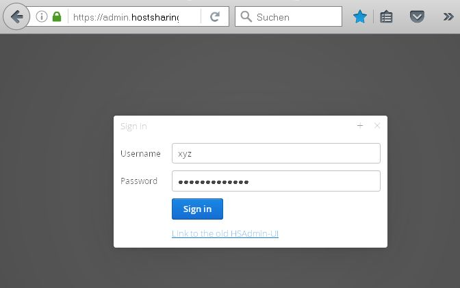
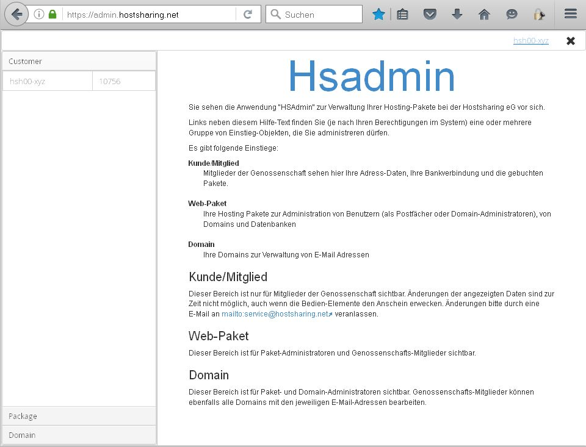
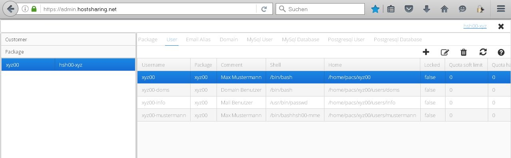
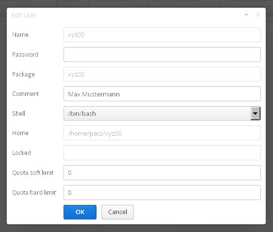

===========================
Web-Paket in Betrieb nehmen
===========================

Um ein Web-Paket in Betrieb zu nehmen, wird ein Passwort für den :doc:`Paket-Admin<../administration/benutzer/paket-admin>` vergeben. Die Konfiguration erfolgt mit dem Webfrontend, hierzu den Link https://admin.hostsharing.net in einem Browser aufrufen, es erfolgt eine Weiterleitung zur Login Seite https://login.hostsharing.net.

Es wird die Mitgliederkennung beim Benutzernamen und unter Passwort das entsprechende Passwort eingetragen.

Nach erfolgreichem Login wird die Startseite angezeigt.

Es wird ein Passwort für den Paket-Admin des Web-Pakets xyz00 vergeben:

Dazu links unten zunächst auf Packge auswählen.

Dort links das entsprechende Paket xyz00 auswählen
dann im Rechten Fenster den Tab *User* anklicken.

Zum Schluss das entsprechende Paket auswählen und mit dem *Edit-Symbol* bearbeiten.

Nun kann ein Passwort für den Paket-Admin vergeben werden. Ein Kommentar zum Paket-Admin kann hinterlegt werden, alle weiteren Einträge werden unverändert übernommen.

Bestätigung mit dem *OK* Button.

