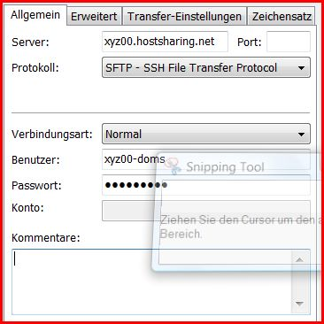
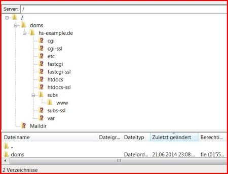

===================
Webspace einrichten
===================
Ordnerstruktur
==============

Im folgenden die exemplarische Struktur des Home-Verzeichnisses eines
:doc:`../administration/benutzer/domain-admin`::

    ├── doms
    │   ├── domain1.tld
    │   │   ├── app
    │   │   ├── app-ssl
    │   │   ├── cgi
    │   │   ├── cgi-ssl
    │   │   ├── etc
    │   │   │   └── pri.domain1.tld
    │   │   ├── fastcgi
    │   │   │   └── phpstub
    │   │   ├── fastcgi-ssl
    │   │   │   └── phpstub
    │   │   ├── htdocs
    │   │   │   └── .htaccess
    │   │   ├── htdocs-ssl
    │   │   │   └── .htaccess
    │   │   ├── subs
    │   │   │   ├── www
    │   │   │   │   └── index.html
    │   │   │   └── example
    │   │   ├── subs-ssl
    │   │   │   └── www
    │   │   │       └── index.html
    │   │   └── var
    │   └── domain2.tld
    │       ├── app
    │       └── …
    ├── etc
    │   └── config.ini
    ├── Maildir
    ├── procmail.log
    ├── vacation.cache
    └── vacation.msg

``~/doms``
    Alle dem Domain-Admin zugewiesenen Domains liegen im Verzeichnis ``doms``.

    ``~/doms/domain1.tld``
        ``domain1`` steht für eine beliebige Domain und ``tld`` für eine beliebige top level domain z.B.
        ``com``, ``net``, ``org``, ``de``.
    ``~/doms/domain1.tld/app``
        Dieses Verzeichnis ist als ``PassengerAppRoot`` des Apache-Webserver-Moduls `Phusion Passenger
        <https://www.phusionpassenger.com/>`_ konfiguriert. 
    ``~/doms/domain1.tld/app-ssl``
        Auch dieses Verzeichnis ist als ``PassengerAppRoot`` des Apache-Webserver-Moduls konfiguriert.
    ``~/doms/domain1.tld/cgi``
        Dies ist das Basisverzeichnis für CGI-Skripte. Ein Alias bildet HTTP-Requests auf ``/cgi-bin/`` für
        alle Zugriffe auf den Virtual Host auf dieses Verzeichnisses ab.
    ``~/doms/domain1.tld/cgi-ssl``
        Analog ``~/doms/domain1.tld/cgi`` das Basisverzeichnis für CGI-Skripte beim Zugriff via https.
    ``~/doms/domain1.tld/etc``
        Dieses Verzeichnis enthält ggf. das Zonefile, mit der sich der Nameserver `BIND
        <http://de.wikipedia.org/wiki/BIND>`_ konfigurieren lässt:

            ``~/doms/domain1.tld/etc/pri.domain1.tld``
                Mit dieser Datei können Sie ein Zonendatei für Ihre Domain selbst verwalten. Damit können z.B.
                einzelne Subdomains auf andere Server umgeleitet, eigene Mailserver angesprochen werden etc.

    ``~/doms/domain1.tld/fastcgi``
        Dies ist das Basisverzeichnis für FastCGI-Skripte. Ein Alias bildet HTTP-Requests auf
        ``/fastcgi-bin/`` für alle Zugriffe auf den Virtual Host auf dieses Verzeichnis ab.
    ``~/doms/domain1.tld/fastcgi-ssl``
        Analog ``~/doms/domain1.tld/fastcgi`` ist dies das Basisverzeichnis
        für FastCGI-Skripte, allerdings diesmal für https-Zugriffe. Ein Alias bildet HTTP-Requests
        auf ``/fastcgi-bin/`` für alle Zugriffe auf den Virtual Host auf dieses Verzeichnis ab.
    ``~/doms/domain1.tld/htdocs``
        Dieses Verzeichnis ist als ``DocumentRoot`` des Apache Webserver konfiguriert. 

        Es dient auch zur Aufnahme statischer Inhalte im Zusammenhang mit der Nutzung von Phusion Passenger
        zur Auslieferung der statischen Dateien.

        ``~/doms/domain1.tld/htdocs/.htaccess``
            In der Standardkonfiguration enthält diese Datei die Weiterleitung auf die ``www``-Subdomain::

                Redirect permanent / http://www.domain1.tld/

            Die verwendeten Regeln werden auf **alle** Subdomains von ``domain1.tld`` aus. In der
            ``.htaccess`` können

            - eigene Fehlerseiten definiert,
            - MIME-Typen zugewiesen,
            - Passwortschutz eingerichtet,
            - Weiterleitungen durchgeführt werden. 

    ``~/doms/domain1.tld/htdocs-ssl``
        Analog ``~/doms/domain1.tld/htdocs`` ist dieses Verzeichnis als
        ``DocumentRoot`` des Apache Webserver für Zugriffe via https konfiguriert. 
    ``~/doms/domain1.tld/subs``
        Dieses Verzeichnis enthält alle Subdomains. Hier findet sich auch die Subdomain *www.domain1.tld*.

        ``~/doms/domain1.tld/subs/example``
            Dies ist ein Beispiel für eine Subdomain, die Sie einfach selbst anlegen können. Sie müssen hierzu
            nur ein Verzeichnis anlegen und anschließend die Dateien in das Verzeichnis übertragen.
        ``~/doms/domain1.tld/subs/www``
            Dieses Verzeichnis wird automatisch angelegt und üblicherweise vom Webserver angesprochen, wenn
            keine Subdomain explizit genannt wird (also ``http://domain1.tld`` verweist üblicherweise auf
            ``http://www.domain1.tld``).

    ``~/doms/domain1.tld/subs-ssl``
        Analog  ``~/doms/domain1.tld/subs`` enthält dieses Verzeichnis alle
        Subdomains auf die via https zugegriffen wird.
    ``~/doms/domain1.tld/var``
        in diesem Verzeichnis werden nächtlich die Log-Dateien mit den Zugriffen auf die Domain gepackter Form
        bereitgestellt, wenn dies in ``/home/pacs/xyz00/etc/config.ini`` entsprechend angegeben ist.

Zugangsdaten und Einstellungen
==============================

Um Dateien in das Webpaket kopieren zu können, wird eine Client-Software
benötigt (z.B. FileZilla, WinSCP oder :term:`SCP`).

Server:   xyz00.hostsharing.net

Benutzer: xyz00-doms

Passwort: PASSWORT

z.B.: FTP FileZilla Client Software

Wechsel in den Ordner *www*:

